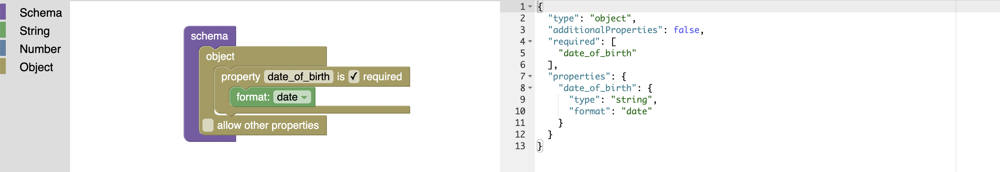

# schematic

## About

This is an educational project mainly intended to deepen my understanding of [JSON Schema][] and to get some practical experience with ClojureScript. The web application is built with [Blockly][] to provide an interactive and beginner-friendly tool to design and learn about schemas.

## Try It Online

https://customcommander.github.io/schematic/

[JSON Schema]: https://json-schema.org/
[Blockly]: https://developers.google.com/blockly
